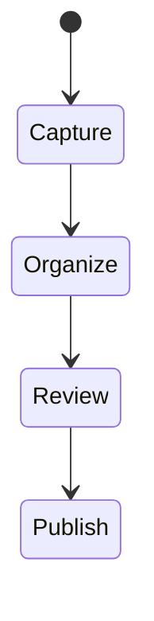

# Markdown 写作系统

这是一篇用于验证笔记目录、侧栏、大纲和评论区的初始笔记。

## 文件组织

笔记放在 `notes/**/*.md` 下。目录名前缀用于排序，标题来自 frontmatter 的 `title` 字段。

## 基础模板

```md
---
layout: page
title: 主题标题
date: YYYY-MM-DD
---

# 主题标题

## 背景

## 结论

## 后续
```

## 记录标准

笔记不需要一次写成完整文章，但至少要保留上下文、结论和下一步。


