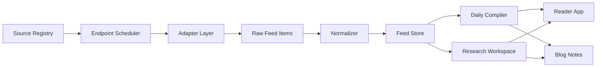

# AI 信息订阅阅读网站设计稿

## 1. 一句话定义

这是一个对标 Folo 产品形态、面向 AI / Agent / Coding Agent 的中文高质量订阅、聚合、阅读网站。

它不是通用 RSS Reader。它的核心价值是帮助用户优化每日 information diet：订阅少量但高质量的信息源，过滤低信号噪音，把分散信息整理成可阅读、可追踪、可沉淀的中文日报和主题内容。

第一阶段先服务个人使用体验，不追求源数量、覆盖面或公开产品规模。只有当个人信息源订阅、阅读体验、日报编排都足够舒服之后，再考虑开源和公开化。

产品形态必须是 Web-first：用户通过浏览器完成订阅源浏览、日报阅读、主题检索和深度调研。自动化、RSSHub、collector、compiler 都是后台能力，不是用户感知到的主产品。

## 2. 产品目标

### 2.1 用户目标

目标用户是长期关注 AI、LLM、Agent、Coding Agent、AI 工程实践的人，包括：

- 正在重度使用 Codex、Claude Code、Cursor、CodeWhale 等 coding agent 工具的工程师
- 正在构建 agent 系统、workflow、multi-agent runtime、工具调用链路的人
- 想系统学习 LLM / Agent 工程能力的人
- 希望减少低质量信息摄入、保留高信号源的人

### 2.2 产品目标

第一版要解决四件事：

1. 明确订阅哪些高质量 AI / Agent 信息源。
2. 明确每个信息源如何获取更新：官方 RSS/API 优先，RSSHub 补缺，自定义抓取兜底。
3. 把不同来源归一化为统一 feed item。
4. 每日编排成 `硬新闻 / 案例 / 有意思` 三个栏目，并可被独立 reader app 和现有博客共同消费。
5. 支持围绕一个主题做 deep research：从订阅源、历史条目和指定链接中收集证据，生成可追溯的中文调研报告。

第一版的判断标准不是“像 Folo 一样全”，而是“对个人每天真的有用、好读、不过载”。

### 2.3 非目标

第一版不做通用阅读器，不追求覆盖所有网站，不做社交功能，不做复杂推荐算法，不做移动端 App，不承诺对外开放。

Deep Research 第一版也不做无限开放式搜索。它优先基于已注册 source、已抓取 feed item、用户指定 URL 和少量必要的外部补充来源，避免变成不可控的泛搜索问答。

第一版也不直接开发完整产品代码。当前阶段目标是完成设计文档，明确最终效果、UI、功能和实现路径。

## 3. 最终效果

用户打开网站后，第一屏不是营销页，而是一份当天已经编排好的 AI 信息日报。

用户应该能立刻完成这些动作：

1. 看当天最值得关注的 3-8 条 AI / Agent / Coding Agent 信息。
2. 按 `硬新闻 / 案例 / 有意思` 三个栏目快速扫描。
3. 点进任意条目，看到原始来源、中文摘要、为什么值得看、对 builder 的启发。
4. 打开 `Sources`，查看网站订阅了哪些源、为什么订阅、每个源如何抓取。
5. 打开 `Topics`，按 `coding-agent`、`llm-engineering`、`builders`、`community` 浏览历史内容。
6. 打开 `Research`，输入一个问题，例如“Claude Code 最近的工程方向是什么”，得到证据列表、来源分组、关键结论和中文调研报告。
7. 在博客里看到精选日报、source registry 说明、深度调研报告和后续长文沉淀。

最终形态应像一个垂直领域的中文 AI Reader，但初期只围绕个人订阅源和个人阅读习惯优化：

- 首页像报纸头版：每天有明确编辑顺序和栏目。
- Sources 像公开订阅目录：透明说明信息从哪里来。
- Item 阅读页像研究卡片：不只放链接，而是解释事实、来源和意义。
- Research 像调研工作台：先展示证据，再给结论，所有判断都能追溯到来源。
- Blog 像杂志和资料库：沉淀周报、专题、长文和学习笔记。

## 4. 产品定位

### 4.1 与 Folo 的关系

Folo 的公开定位是 AI RSS Reader，强调让 AI 帮用户阅读互联网、发现源、保留高信号内容。它的展示形态包括源发现、订阅、阅读、AI 摘要、多平台来源等。

本项目对标 Folo 的阅读器形态，但第一阶段明显收窄：

- Folo 更偏通用 AI RSS Reader。
- 本项目更偏 AI / Agent / Coding Agent 垂直领域。
- Folo 面向广泛阅读需求。
- 本项目面向 AI builder 的 information diet。
- Folo 的重点是阅读体验和 AI 辅助。
- 本项目的重点是高质量源注册表、主题编排、中文日报和工程判断。
- Folo 更适合做开放式订阅发现。
- 本项目先做个人信息源系统，跑顺后再开源。

具体视觉参考优先看 Folo 的 timeline 阅读页，而不是营销首页。可借鉴的部分：

- 左侧轻量 source / category 导航。
- 中间窄列连续文章流，标题、来源、时间、摘要和缩略图构成稳定阅读节奏。
- 右侧保留 AI 操作、摘要、推荐和后续动作区域。
- 整体低装饰、低对比、暗色阅读环境，突出阅读而非炫技。
- 文章 item 不做厚重卡片墙，靠间距、字号和来源标签建立秩序。

不能照搬的部分：

- Folo timeline 默认偏“待读队列”，缺少报纸式编辑排序。
- 本项目第一版需要在 timeline 之上增加 `今日一句判断` 和 `硬新闻 / 案例 / 有意思` 分栏，但暂不引入 `今日头条` 选择逻辑。
- Deep Research 不能只是右侧 AI 提示，应成为独立一级页面和工作台。

### 4.2 右侧阅读区风格

右侧内容区采用可切换的报纸阅读风格。这部分是产品的视觉记忆点，但应限制在右侧阅读 / research pane 中，不影响左侧 source rail 和中间 timeline 的效率。

右侧区域承载：

- 默认展示中间 timeline 当前列表的第一条内容，不使用空白 AI action 作为首屏默认态。
- 选中文章的中文阅读版
- AI 摘要和关键事实
- Deep Research 的结论与证据
- 需要沉淀到博客的草稿预览

视觉语言：

第一版提供三种右侧阅读区 skin：

| Skin | 原型 | 气质 | 适用内容 |
| --- | --- | --- | --- |
| `Broadsheet` | 1 Classic Broadsheet | 权威、正式、经典大报 | 官方更新、changelog、工程文章 |
| `Feature` | 5 Magazine Feature Newspaper | 叙事、长文、专题感 | builder 文章、深度分析、周报 |
| `Retro Dispatch` | 7 Postmodern Retro Newspaper | 像嵌入一张真实报纸页，后现代、刻意复古、有记忆点 | 有意思、案例、research dispatch |

三种 skin 共用同一份内容结构，只改变排版、字体气质、栏线、surface 和局部装饰。

共同内容结构：

- 版面标签：`Edition` / `Desk Note` / `Source Proof` / `Research Dispatch`
- 标题
- 来源、时间、证据级别
- AI 摘要
- 关键事实
- 为什么重要
- Deep Research 入口
- Follow-up questions

### 4.2.1 Broadsheet skin

使用传统大报气质：

- 黑白或近黑白。
- 更强的 serif 标题。
- 窄栏、细栏线、严肃版面。
- 内容密度较高，但保持清晰行距。
- 适合展示官方 changelog、工程发布、API 变更。

### 4.2.2 Feature skin

使用杂志特写式报纸气质：

- 更大的标题区。
- 更强的长文阅读感。
- 可使用一张主图或大引用块。
- 留白比 Broadsheet 更多。
- 适合展示人物、builder 文章、深度专题和博客沉淀内容。

### 4.2.3 Retro Dispatch skin

使用后现代刻意复古气质：

- 右侧内容区不是普通 panel，而是一张完整的报纸页构图。
- 文章标题、AI 摘要、关键事实、source proof、follow-up questions 都排进报纸版面中。
- 用户感觉是在暗色 app 里阅读一张真实生成的 AI 报纸页。
- 版号、日期、source stamp、pull quote、批注感。
- 可以有轻微纸张纹理、印刷颗粒、裁切线，但必须克制。
- 可以略带实验性排版，但不能牺牲可读性。
- 适合展示“有意思”栏目、实战案例和 research dispatch。

报纸页构图建议：

- 顶部：小 masthead，例如 `AI BUILDER DAILY`，加 edition / date / topic line。
- 主标题：使用醒目的 serif display 或中文宋体感标题。
- 主体：两栏或三栏 body block，可以包含 drop cap。
- 右栏：`AI Summary`、`Why It Matters`、`Source Proof`。
- 底部：`Research Dispatch` 和 `Follow-up Questions`。
- 角落：轻量 source stamp / evidence checked 标记。

明确不要做：

- 不做黄旧纸、羊皮纸、仿古边框这类廉价复古。
- 不做大面积装饰花纹。
- 不做影响阅读的纹理和噪点。
- 不把所有文章行都做成报纸卡片；复古感只集中在右侧阅读区。
- 不把报纸页做成纯图片；第一版实现可以是 HTML/CSS 排版，内容字段仍然可选择、可复制、可搜索。
- 不让 skin 影响数据结构和交互逻辑；skin 只决定呈现方式。

默认状态：

- 用户首次打开 `Today` 时，右侧阅读区展示中间 timeline 当前列表的第一条内容。
- 用户点击中间 timeline 任意 item 后，右侧切换为该 item 的阅读版。
- 用户从右侧发起 Deep Research 后，右侧进入调研预览态，并可跳转到完整 `/research/:id`。
- 如果当天没有内容，右侧显示“今日暂无新内容”的编辑说明，而不是泛 AI 空态。

风格切换：

- 右侧阅读区顶部提供轻量 style switcher：`Broadsheet` / `Feature` / `Retro`。
- 默认 skin 可以按栏目自动选择：`硬新闻 -> Broadsheet`，`案例 -> Retro Dispatch`，`有意思 -> Retro Dispatch`，长文/专题 -> `Feature`。
- 用户手动切换后，本地记住偏好。

### 4.3 产品边界

本项目应作为独立应用存在，博客只是共享内容的消费端之一。

- Reader Web App：负责订阅、聚合、阅读、搜索、主题浏览和 deep research 入口。
- Blog：负责长文、专题、日报归档、编辑判断、学习沉淀。
- Shared Data Layer：负责源注册表、抓取、去重、归一化、日报编排和调研证据库。

## 5. 内容策略

### 5.1 三个栏目

每日内容固定分成三个栏目。


| 栏目  | 含义                     | 典型来源                                     | 入选标准                   |
| --- | ---------------------- | ---------------------------------------- | ---------------------- |
| 硬新闻 | 会影响判断的正式更新             | changelog、官方博客、工程文章、release notes、API 更新 | 有明确源头、影响产品/架构/API/工具使用 |
| 案例  | 人们如何真实使用 AI / Agent 工具 | X、HN、GitHub、builder 博客、视频摘要              | 有可验证实践、截图、repo、流程、复盘   |
| 有意思 | 有启发、有传播感、有创造力的内容       | 短视频、帖子、独立博客、实验项目                         | 有新意、可迁移、能引发问题          |


每日总量控制在 3-8 条。

建议配比：

- `硬新闻`：1-3 条
- `案例`：1-3 条
- `有意思`：1-2 条
- `今日一句判断`：1 条

### 5.2 信息源优先级

信息源不是越多越好。第一版只接个人真正会读的高信号源，后续再扩。

第一版建议控制在 5-8 个 source family。新增 source 必须满足两个条件：

1. 它能稳定提供 AI / Agent / Coding Agent 相关高价值信息。
2. 它进入系统后不会显著增加每日阅读负担。


| 优先级 | 类型         | 例子                                                              | 原因               |
| --- | ---------- | --------------------------------------------------------------- | ---------------- |
| P0  | 官方更新       | CodeWhale changelog、Anthropic engineering、Pydantic / PydanticAI | 事实确定、信号强         |
| P1  | 关键 builder | Waylandz、LitoMore、shumer.dev                                    | 能看到实践者的长期判断和项目动作 |
| P1  | 课程/材料库    | The Modern Software Developer / CS146S                            | 系统化整理 coding LLM、agent、MCP、Claude Code、AI 安全等学习路径 |
| P2  | 社区实战       | X、Hacker News、GitHub 热点                                         | 能看到真实使用方式和传播信号   |
| P3  | 视频/短内容     | Bilibili、抖音                                                     | 灵感价值高，但结构化和稳定性较弱 |


### 5.3 首批 source family


| Family        | 主题              | 主要用途                                         | 默认栏目 |
| ------------- | --------------- | -------------------------------------------- | ---- |
| codewhale     | coding-agent    | 跟踪成熟 coding agent 的产品和架构变化                   | 硬新闻  |
| waylandz      | builder         | 跟踪 AI Agent Book、作者文章、GitHub 和视频动态           | 案例   |
| anthropic     | llm-engineering | 跟踪 Claude Code、Claude engineering、agent 工程文章 | 硬新闻  |
| pydantic      | agent-stack     | 跟踪 Pydantic / PydanticAI 的工程生态               | 硬新闻  |
| reasonix      | coding-agent    | 跟踪 coding agent / reasoning 工具变化             | 硬新闻  |
| hacker-news   | community       | 发现社区讨论和工程案例                                  | 案例   |
| x-agent-cases | community       | 捕捉人们如何用 agent / Codex / Claude Code 做事       | 案例   |
| shumer        | builder         | 跟踪独立 builder 的高价值文章                          | 有意思  |
| litomore      | builder         | 跟踪 GitHub 项目和作者动态                            | 案例   |


资料型来源不计入每日 5-8 个核心 source family 的数量约束。它们用于 source registry 公开说明、deep research 证据库、学习路线和后续长文沉淀，只有出现新增高价值材料或被专题调研引用时才进入 Today。

| Family              | 主题             | 主要用途                                      | 默认栏目 |
| ------------------- | ---------------- | --------------------------------------------- | ---- |
| modern-software-dev | course-materials | 索引现代 AI 软件工程课程材料，支撑学习路线和 deep research | 案例   |


## 6. 信息架构

### 6.1 独立应用页面

第一版 Reader App 至少需要这些页面：


| 页面    | 路径建议             | 目标                                                           |
| ----- | ---------------- | ------------------------------------------------------------ |
| 今日日报  | `/today`         | 每日 3-8 条精选，按三个栏目展示                                           |
| 信息流   | `/feeds`         | 查看所有归一化后的 feed items                                         |
| 信息源目录 | `/sources`       | 展示已订阅 source families 和 endpoints                            |
| 主题页   | `/topics/:topic` | 按 `coding-agent`、`llm-engineering`、`builders`、`community` 浏览 |
| 深度调研  | `/research`      | 发起主题调研、查看调研队列和历史报告                                           |
| 调研报告页 | `/research/:id`  | 阅读证据化中文调研报告                                                  |
| 文章阅读页 | `/items/:id`     | 阅读原文摘要、AI 重组、来源证据和标签                                         |
| 内容搜索页 | `/search`        | 搜索源、文章、标签、作者、摘要和已抓取内容；第一版不承诺完整网页全文搜索                       |


### 6.2 博客消费页面

现有博客不承载完整 reader 功能，只消费编排结果：


| 页面                 | 位置建议                              | 目标             |
| ------------------ | --------------------------------- | -------------- |
| 项目设计稿              | `notes/05-ai-information-reader/` | 记录产品和架构设计      |
| 日报归档               | `notes/06-ai-daily/`              | 公开每日精选内容       |
| Source Registry 说明 | `notes/07-source-registry/`       | 公开哪些源被订阅、为什么订阅 |
| 深度文章               | `posts/`                          | 把重要观察扩展成长文     |


### 6.3 导航模型

Reader App 的主导航建议是：

- `Today`
- `Feeds`
- `Sources`
- `Topics`
- `Research`
- `Search`

博客的主导航不需要同步 reader app 的全部功能，只需要暴露：

- `AI Daily`
- `Source Registry`
- `Agent Learning`

## 7. UI 设计稿

### 7.1 设计原则

UI 不做营销页，不做大 hero。第一屏直接是可阅读的信息工作台。

视觉方向：

- 参考 Folo timeline 的克制阅读器风格，再叠加现代数字报纸的编辑层级。
- 左侧和中间是高效率暗色阅读器，右侧是后现代复古报纸阅读区。
- 信息密度高，但不压迫。
- 桌面端优先支持快速扫描。
- 移动端优先保持栏目顺序和阅读稳定性。
- 颜色克制，避免娱乐化和过度装饰。
- 避免厚重卡片墙，文章列表更接近阅读队列。

### 7.2 首页 / 今日日报

桌面端布局：

```text
┌──────────────────────────────────────────────────────────────┐
│ Top Bar: Logo / Today / Feeds / Sources / Topics / Search     │
├───────────────┬──────────────────────────────────────────────┤
│ Left Rail     │ Today · 2026-06-16                            │
│               │ 今日一句判断                                  │
│ Topics        │ ───────────────────────────────────────────   │
│ Sources       │ 硬新闻                                        │
│ Saved         │ [Item] [Item] [Item]                           │
│               │ 案例                                          │
│               │ [Item] [Item]                                  │
│               │ 有意思                                        │
│               │ [Item]                                        │
└───────────────┴──────────────────────────────────────────────┘
```

Folo-style 变体：

```text
┌──────────────┬───────────────────────────────┬──────────────────┐
│ Source Rail  │ Today Timeline                 │ Newspaper Reader │
│              │                               │                  │
│ 文章          │ 今日一句判断                    │ First Item Read  │
│ AI           │ Article Row                    │ Edition Note     │
│ Developer    │ 硬新闻                         │ Source Proof     │
│ News         │ Article Row                    │ Follow-up        │
│ Science      │ Article Row                    │                  │
│              │ 案例                           │                  │
│              │ Article Row                    │                  │
│              │ 有意思                         │                  │
└──────────────┴───────────────────────────────┴──────────────────┘
```

这个变体是首选方向：保留 Folo 的三栏阅读器感，但中间列不是全量 pending queue，而是经过栏目整理的每日列表；右侧不是普通工具栏，而是默认展示当前列表第一条内容的可切换报纸阅读区。

移动端布局：

```text
┌────────────────────────────┐
│ Top Bar                    │
├────────────────────────────┤
│ Today · 日期                │
│ 今日一句判断                │
├────────────────────────────┤
│ Tabs: 硬新闻 / 案例 / 有意思 │
├────────────────────────────┤
│ Item                       │
│ Item                       │
│ Item                       │
└────────────────────────────┘
```

日报 item 卡片字段：

- 标题
- 来源
- 发布时间
- 栏目标签
- 重要性等级
- 2-4 句中文摘要
- 为什么值得看
- 原文链接

### 7.3 信息源目录页

目标是让用户理解“我们订阅了谁，以及为什么”。

每个 source family 展示：

- 名称
- 主题
- 默认栏目
- 订阅理由
- endpoint 数量
- 最近更新时间
- 可靠性
- 进入日报次数

Source family 详情页展示：

- 订阅理由
- 适合进入哪些栏目
- endpoints 列表
- 每个 endpoint 的抓取方式
- 认证需求
- 失败状态
- 最近抓取样例

### 7.4 Feed Item 阅读页

阅读页不是简单复制原文，而是围绕判断组织：

- 原始标题
- 中文标题
- 来源与作者
- 原文链接
- 证据类型：官方 / GitHub / 社区 / 视频 / 自定义抓取
- AI 摘要
- 关键事实
- 对 AI / Agent builder 的意义
- 相关 source family
- 相关历史条目

### 7.5 Deep Research 工作台

Deep Research 是网站的第二个核心 Web 页面。它不替代每日信息流，而是用于回答一个具体问题。

典型问题：

- Claude Code 最近的工程方向是什么？
- CodeWhale 0.8.60 到 0.8.61 的 runtime 变化说明了什么？
- 最近 builder 们如何实际使用 coding agent 做开发？

桌面端布局：

```text
┌────────────────────────────────────────────────────────────────────┐
│ Top Bar: Today / Feeds / Sources / Topics / Research / Search       │
├──────────────────┬──────────────────────────────┬─────────────────┤
│ Research Queue   │ Research Brief                │ Evidence Board  │
│                  │                              │                 │
│ New Question     │ Question                      │ Source Groups   │
│ Saved Reports    │ Scope                         │ Official        │
│ Topic Filters    │ Key Findings                  │ GitHub          │
│                  │ Timeline / Diff               │ Community       │
│                  │ Open Questions                │ Video / Other   │
└──────────────────┴──────────────────────────────┴─────────────────┘
```

移动端布局：

```text
┌────────────────────────────┐
│ Top Bar                    │
├────────────────────────────┤
│ Research Question          │
├────────────────────────────┤
│ Tabs: 结论 / 证据 / 来源 / 待跟进 │
├────────────────────────────┤
│ Research Brief             │
└────────────────────────────┘
```

Research report 字段：

- 调研问题
- 调研范围
- 关键结论
- 证据列表
- 来源分组
- 时间线或版本差异
- 不确定点
- 待跟进行动
- 可发布到博客的中文报告

### 7.6 Google Stitch 原型流程

UI 原型优先使用 Google Stitch 做第一轮高保真探索。Stitch 用于快速生成 Web / mobile UI 方向、页面结构和可编辑设计稿，不作为最终设计权威。

使用方式：

1. 用 `02-google-stitch-brief.md` 的 prompt 生成第一版 Web UI。
2. 优先生成 4 个核心页面：`Today`、`Sources`、`Research`、`Item Detail`。
3. 输出后人工筛选信息密度、阅读节奏、栏目层次和移动端表现。
4. 把选中的 UI 结果回填到本设计稿：颜色、布局、组件和交互规则。
5. 如果导出到 Figma 或 HTML/CSS，仍需要二次工程审查，避免生成式 UI 带来的同质化和不可维护结构。

Stitch 生成稿必须满足：

- 第一屏是可用的信息产品，不是营销落地页。
- 必须是 Web-first，并包含移动端响应式版本。
- 必须包含 Deep Research 工作台，不只包含日报阅读。
- UI 文案以中文为主。
- 视觉气质是高信号、克制、可长期阅读，而不是泛科技营销页。

## 8. 系统架构

### 8.1 总体数据流




### 8.2 模块职责


| 模块                 | 职责                        | 不负责          |
| ------------------ | ------------------------- | ------------ |
| Source Registry    | 记录订阅对象、endpoint、获取方式、栏目映射 | 实际抓取         |
| Endpoint Scheduler | 根据频率调度抓取任务                | 判断内容价值       |
| Adapter Layer      | 按不同方式抓取内容                 | 输出最终日报       |
| Normalizer         | 统一字段、生成 item hash、提取时间和来源 | 改写观点         |
| Feed Store         | 存储原始 item、归一化 item、抓取状态   | 公开展示         |
| Daily Compiler     | 选出每日 3-8 条，分栏目，生成摘要       | 负责底层抓取       |
| Research Workspace | 围绕问题组织证据、来源、结论和报告         | 无限制泛搜索       |
| Reader App         | 浏览、阅读、搜索、订阅源展示            | 存储私密 token   |
| Blog Exporter      | 输出公开 Markdown 日报和专题文章     | 完整 reader 交互 |


## 9. 源注册表设计

### 9.1 Source Family

Source family 表示一个订阅对象，例如 `waylandz`、`anthropic`、`codewhale`。

建议字段：

```yaml
family_id: waylandz
family_name: Wayland Zhang
theme: builders
default_column: 案例
priority: P1
public_description: 重点关注的 AI Agent builder / 作者 / 项目族。
editorial_reason: 跟踪 agent 产品、教程、项目实践和作者判断。
homepage: https://waylandz.com/
tags:
  - agent
  - builder
  - ai-engineering
```

### 9.2 Endpoint

Endpoint 表示一个 family 的具体抓取入口。

```yaml
endpoints:
  - id: website_blog
    label: Blog
    source_url: https://waylandz.com/blog/
    adapter_type: official_rss
    fallback_adapters:
      - custom_scraper
    default_column: 硬新闻
    polling_strategy: daily
    auth_requirements: none
    reliability: high
    dedupe_key: url
    notes: 博客正文和新文章优先作为一手信号。

  - id: bilibili_dynamic
    label: Bilibili Dynamic
    source_url: https://space.bilibili.com/3546611527453161
    adapter_type: rsshub
    fallback_adapters: []
    default_column: 有意思
    polling_strategy: daily
    auth_requirements: maybe_cookie
    reliability: medium
    dedupe_key: title+date
    notes: 更偏灵感和动态，不作为最高优先级主信号。
```

### 9.3 适配器优先级

固定顺序：

1. `official_rss`
2. `official_api`
3. `github_feed`
4. `github_api`
5. `rsshub`
6. `custom_scraper`

原则：

- 能用官方 RSS/API 就不用 RSSHub。
- GitHub 相关内容优先用 GitHub feed/API。
- RSSHub 用来补齐 Bilibili、X、Douyin、部分缺 RSS 的站点。
- 自定义抓取只用于高价值且没有稳定 feed 的源。

## 10. 统一 Feed Item Schema

所有来源最终归一化为同一种 item。

```yaml
id: item_20260616_codewhale_0861
source_family_id: codewhale
endpoint_id: changelog
source_url: https://github.com/Hmbown/CodeWhale/blob/main/CHANGELOG.md
canonical_url: https://github.com/Hmbown/CodeWhale/blob/main/CHANGELOG.md
title: CodeWhale 0.8.61 changelog updated
title_zh: CodeWhale 0.8.61 更新运行时控制面说明
author: Hmbown
published_at: 2026-06-15T00:00:00+00:00
fetched_at: 2026-06-16T09:00:00+08:00
content_hash: sha256:...
dedupe_key: canonical_url+content_hash
language: en
default_column: 硬新闻
topics:
  - coding-agent
  - runtime
  - multi-agent
importance: high
evidence_level: official
summary_zh: ...
why_it_matters: ...
raw_payload_ref: raw/codewhale/2026-06-16.json
state:
  read_at: null
  saved_at: null
  favorited_at: null
  archived_at: null
```

### 10.1 阅读状态语义

第一版必须明确区分 `保存`、`收藏` 和 `书签`，避免把三者都做成“mark item”的同义动作。

| 状态 | 作用 | 主要对象 | 生命周期 |
| --- | --- | --- | --- |
| `saved` / 保存 | 稍后读，表示这篇文章需要稍后处理或继续阅读 | feed item | 短期状态，可以清空或归档 |
| `favorited` / 收藏 | 长期保留，表示这篇文章有复盘、周报、知识库或研究价值 | feed item | 长期状态，默认保留 |
| `bookmark` / 书签 | 固定入口，表示某个视图、source、topic 或搜索条件需要快速访问 | source、topic、search view、feed view | 导航状态，可随时调整 |

文章列表第一版只暴露两个主动作：

- `保存`：稍后读。
- `收藏`：长期保留。

`书签` 不作为文章收藏的同义词，优先用于固定 source、topic、search view 或 feed view。

### 10.2 内容搜索边界

第一版搜索命名为 `内容搜索`，不命名为 `全文搜索`。

搜索范围包括：

- title
- source name
- author
- summary
- raw excerpt
- tags
- topic
- RSSHub feed 中已经带回来的 content 字段

第一版不承诺抓取原网页全文，也不承诺所有文章都能按完整正文命中。后续如果加入 Readability、正文抽取和正文索引，再升级为真正的全文搜索。

## 11. Daily Compiler

### 11.1 输入

Daily Compiler 从 Feed Store 读取：

- 最近 24 小时新增 item
- 最近 7 天未进入日报但仍有价值的 item
- 高优先级 source family 的变化
- 前一日状态和去重记录

### 11.2 筛选规则

入选每日简报需要满足至少一个条件：

- 官方源发生真实变化
- 高优先级 builder 发布新内容
- 社区出现可验证的 agent 实战案例
- 信息能解释 AI / Agent / Coding Agent 的产品或架构趋势
- 内容有独特启发，并能写出“为什么值得看”

排除规则：

- 纯营销
- 纯情绪
- 无原始来源
- 无法验证的截图流传
- 和 AI / Agent / Coding Agent 关系弱
- 重复观点但没有新事实

### 11.3 输出模板

```md
# AI Daily · YYYY-MM-DD

## 今日一句判断

...

## 硬新闻

### 1. 标题

- 来源：
- 发生了什么：
- 为什么重要：
- 对 builder 的启发：

## 案例

...

## 有意思

...

## 今日待跟进

...
```

## 12. 首版功能范围

### 12.1 MVP 必须有

- Source Registry 文档化
- Endpoint 配置，第一版由项目配置文件手动维护，不提供用户新增订阅源 UI
- 5-8 个个人精选 source family
- 先以 RSSHub feed 作为主要订阅来源；官方 RSS / GitHub feed 可作为已知稳定源保留
- Feed item 归一化
- 去重和状态记录
- 阅读状态：`read`、`saved`、`favorited`、`archived`
- 书签对象：source、topic、search view、feed view
- 内容搜索：标题、来源、作者、摘要、标签、topic、已抓取内容字段
- 每日 3-8 条日报生成
- Reader App 的 Today / Sources / Item 页面设计
- Blog Markdown export
- 明确的个人使用反馈入口：保留、降权、移除 source 的理由必须可记录

### 12.2 MVP 可以暂缓

- 账号系统
- 多用户订阅
- 个性化推荐
- 评论
- 移动 App
- 完整网页全文搜索
- 新增订阅源 UI
- 类似 Folo Discover 的自动识别、发现和导入流程
- 自动全文翻译
- 视频自动转写
- 开源发布
- 外部用户导入自己的订阅源

### 12.3 第一批可落地源


| Source        | Endpoint           | Adapter                               | 备注                           |
| ------------- | ------------------ | ------------------------------------- | ---------------------------- |
| CodeWhale     | GitHub CHANGELOG   | custom changelog monitor / github raw | 已有自动化基础                      |
| Waylandz      | Blog / Website     | official_rss 或 custom                 | 先确认 feed 地址                  |
| Waylandz      | GitHub             | github_feed                           | 跟踪 repo 和作者动态                |
| Anthropic     | Engineering / News | RSSHub 或 custom                       | Claude Code 和 agent 工程文章重点关注 |
| Pydantic      | Blog / Articles    | official_rss 或 custom                 | PydanticAI 相关优先              |
| Hacker News   | frontpage / search | official_rss 或 hnrss                  | 只做筛选，不做全量搬运                  |
| X Agent Cases | keyword/list       | RSSHub 或外部 API                        | 需要 token 和更严格过滤              |
| The Modern Software Developer | Course / Syllabus Links | manual / custom static-site extractor | 资料型源；先做索引和专题证据，不作为日更流 |


## 13. 数据存储建议

第一阶段可以用文件优先，降低复杂度。

建议目录：

```text
data/
  source-registry/
    families/
      coding-agent/codewhale/
      builders/waylandz/
      llm-engineering/anthropic/
  feed-store/
    raw/
    normalized/
    state/
  daily/
    2026-06-16.json
notes/
  05-ai-information-reader/
  06-ai-daily/
  07-source-registry/
```

后续如果独立 App 成型，再迁移到数据库：

- SQLite：适合个人部署和原型
- Postgres：适合公开产品和多用户
- Meilisearch / Typesense：适合后续搜索体验

## 14. 技术实现建议

### 14.1 前台

如果作为独立应用：

- Next.js / Nuxt / SvelteKit 都可行
- 当前博客是 VitePress，不建议直接把完整 reader app 塞进博客
- 如果继续用 Vue 生态，Nuxt 更自然
- 如果追求工程生态和组件资源，Next.js 更常见

建议第一版独立 App 选择一种主栈后固定，不要同时维护多套前端。

### 14.2 后台

后台可以分成四类任务：

- `collector`：抓取 endpoints
- `normalizer`：归一化 item
- `compiler`：编排日报
- `exporter`：输出 blog markdown 和 app 数据

### 14.3 RSSHub

RSSHub 适合作为 adapter 补缺，不适合作为唯一来源层。

v0.1 的实际实现路线：

- 在 Reader App 服务端直接使用 `rsshub` npm package：`init()` 一次初始化，`request('/route')` 按 route 拉取数据。
- 不优先依赖公共 `rsshub.app` 实例；公共实例可作为调试参考，但不作为产品稳定入口。
- Source Registry 继续作为 source-of-truth，记录 source family、route、优先级、内容类型和为什么订阅。
- Feed Hub API 负责把 RSSHub 返回的 `Data.item[]` 归一化成内部 `FeedItem`，前端只消费统一的 `/api/feed-hub` JSON。
- 第一批 tracer route：`/anthropic/engineering`、`/claude/code/changelog`、`/cursor/changelog`。
- 第一版仍然不做新增订阅源 UI；route 由项目配置手动维护，等订阅源数量和维护痛点真实出现后，再评估 Folo Discover 式的 URL 自动识别和导入。

自建 RSSHub 的价值：

- 可配置 X / Bilibili / 其他平台所需 token 或 cookie
- 可稳定控制 route 和缓存
- 可扩展自定义 route
- 避免依赖公共实例的不稳定性

但它的边界也要写清楚：

- 强反爬平台可靠性较低
- 需要状态监控
- 对有官方 feed 的源不应优先使用 RSSHub
- `rsshub` package 采用 AGPL-3.0，需要在公开部署或二次分发前复核许可证影响

## 15. 错误处理与可靠性

### 15.1 抓取失败

每个 endpoint 记录：

- `last_success_at`
- `last_failure_at`
- `failure_count`
- `last_error_message`
- `health_status`

日报生成时：

- 某个低优先级 endpoint 失败，不阻塞日报
- P0 endpoint 失败，日报中记录内部警告，不生成假内容
- 连续失败达到阈值，source 进入降级状态

### 15.2 去重

去重优先级：

1. canonical URL
2. guid
3. title + published_at
4. content hash

对于 changelog 这类单 URL 多次变化的源，必须使用 normalized content hash。

### 15.3 证据级别

每条 item 记录 evidence level：

- `official`
- `github`
- `builder`
- `community`
- `video`
- `scraped`

日报里官方来源和社区来源要明确区分。

## 16. 阶段计划

### Phase 0：文档与边界

目标：

- 完成本设计稿
- 定义 source registry schema
- 定义首批 source family
- 定义日报模板

完成标准：

- 能清楚回答“订阅谁、怎么抓、怎么展示、怎么进入日报”

### Phase 1：个人可用的 Feed Hub

目标：

- 文件型 source registry
- 5-8 个个人精选源可抓取
- 生成 normalized feed item
- 手动或自动生成每日 Markdown

完成标准：

- 每天能稳定产出 3-8 条高信号日报
- 私有状态不进入公开博客
- 连续使用一段时间后，能明确哪些源该保留、降权或移除

### Phase 2：Reader App MVP

目标：

- Today 页面
- Sources 页面
- Item 阅读页
- 基础搜索
- 博客内容导出

完成标准：

- 用户打开网站即可像使用垂直 AI Reader 一样阅读今日精选和源目录

### Phase 3：开源与公开产品化

目标：

- 清理私有配置、token、个人状态和不可公开源
- 整理部署文档和示例 source registry
- 更完整的源发现
- 用户收藏
- AI 摘要和中文重组
- 周报/月报
- 订阅源健康监控

完成标准：

- 它先作为个人系统跑顺，再以可部署、可配置、无私密状态泄露的方式开源
- 它不只是个人自动化，而是面向外部读者的 AI 高质量订阅阅读网站

## 17. 验收标准

设计稿完成后，应能回答这些问题：

1. 网站最终长什么样？
2. 它和博客是什么关系？
3. 它参考 Folo 的哪些点，又不做哪些点？
4. 每天展示哪些栏目？
5. 每个信息源如何登记？
6. 每个 endpoint 如何抓取？
7. RSSHub 在系统中处于什么位置？
8. feed item 的统一 schema 是什么？
9. 如何去重、失败降级和记录状态？
10. 第一版 MVP 做什么，不做什么？

## 18. 参考资料

- [Folo](https://folo.is/)
- [Google Stitch](https://stitch.withgoogle.com/)
- [Google Developers Blog: Introducing Stitch](https://developers.googleblog.com/stitch-a-new-way-to-design-uis/)
- [RSSHub 文档](https://docs.rsshub.app/)
- [RSSHub Docker Compose 部署](https://docs.rsshub.app/install/#docker-compose-bu-shu)
- [CodeWhale CHANGELOG](https://github.com/Hmbown/CodeWhale/blob/main/CHANGELOG.md)
- [Waylandz](https://waylandz.com/)
- [Anthropic Engineering](https://www.anthropic.com/engineering)
- [Hacker News](https://news.ycombinator.com/news)
- [The Modern Software Developer](https://themodernsoftware.dev/)
