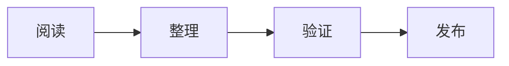

## 为什么建这个博客

这个站点用于保存学习内容、工程实践和长期思考。它不是社交媒体动态，也不是临时草稿堆，而是一个可以持续引用和复盘的公开知识库。

我会把内容分成两类：

- 文章：较完整的主题整理、复盘和阶段性总结。
- 笔记：学习过程中的结构化材料、命令、概念和小实验。

## 写作原则

每篇 Markdown 都应该能回答三个问题：

1. 这篇内容解决什么问题。
2. 当前结论依赖哪些事实。
3. 后续复盘时应该从哪里继续。

## Markdown 能力检查

代码块：

```ts
export function hello(name: string): string {
  return `hello, ${name}`
}
```

数学公式：

$$
E = mc^2
$$

Mermaid 图：



## 下一步

后续文章会从实际学习和项目实践中自然生长。内容会优先保持小而完整，而不是追求一次写完所有东西。
